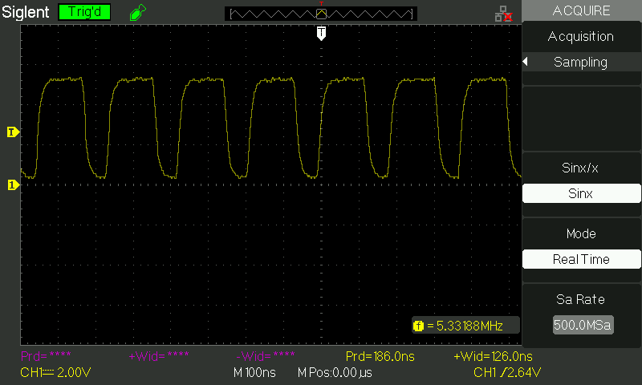
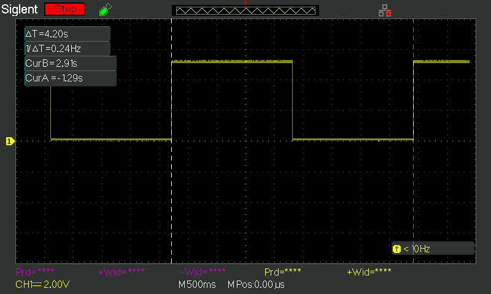
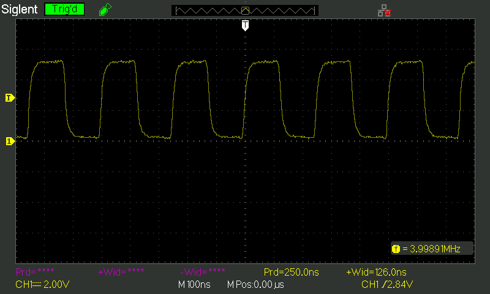
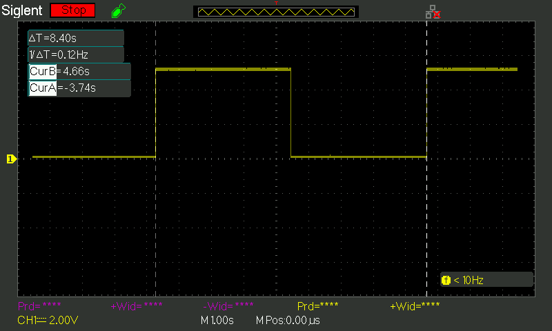

# Fast PWM
Fast PWM operates with a frequency of `f = f_I/O / (N * (TOP+1))`, where `f_I/O` is the I/O clock frequency, `N` is the prescaler, and `TOP` is the top value used in the timer/counter.

The **fastest fast PWM** signal will occur when `TOP` is as small as possible. Using a `TOP` value of `0` and prescaler of 1, a timer/counter can be used in CTC mode with a max frequency of `f_I/O / 2`, but with no way to modulate the duty cycle.

To change the duty cycle, the largest `TOP` value would be `2` and a prescaler of 1. This leads to a frequency of `f_I/O / 3`. The only duty cycle options are 0%, 50%, and 100%. The output may not have clean transitions between LOW and HIGH output levels.

> Fast PWM with `TOP=2`, prescaler of 1, and duty-cycle of 50% on timer/counter 0. Note the lack of sharp transition on rising and falling edges, and duty-cycle not exactly 50%.

The **slowest fast PWM** signal will occur while using a 16-bit timer/counter, using the largest prescaler value, and `TOP=0xFFFF`.

> Fast PWM with `TOP=0xFFFF`, prescaler of 1024, and duty-cycle of 50% on timer/counter 0.

# Phase-Correct PWM
Phase-correct PWM operates with a frequency of `f = f_I/O / (2 * N * TOP)`, where `f_I/O` is the I/O clock frequency, `N` is the prescaler, and `TOP` is the top value used in the timer/counter.

The **fastest phase-correct PWM** signal will occur when `TOP` is as small as possible. Using a `TOP` value of `0` and prescaler of 1, a timer/counter can be used in CTC mode with a max frequency of `f_I/O / 2`, but with no way to modulate the duty cycle.

To change the duty cycle, the largest `TOP` value would be `2` and a prescaler of 1. This leads to a frequency of `f_I/O / 4`. The only duty cycle options are 0%, 50%, and 100%. The output may not have clean transitions between LOW and HIGH output levels.

> Phase-correct PWM with `TOP=2`, prescaler of 1, and duty-cycle of 50% on timer/counter 0. Note the lack of sharp transition on rising and falling edges.

The **slowest phase-correct PWM** signal will occur while using a 16-bit timer/counter, using the largest prescaler value, and `TOP=0xFFFF`.

> Fast PWM with `TOP=0xFFFF`, prescaler of 1024, and duty-cycle of 50% on timer/counter 0.
