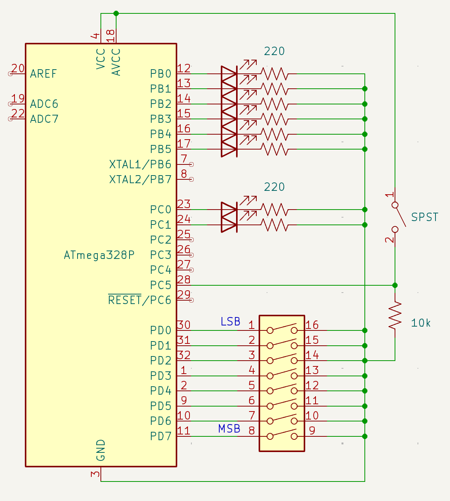

Following is an example lab report that I wrote for Lab 17. This should hopefully give you an example of how detailed to be when writing a lab report for ENGIN-2223. Note that it does not include text or schematics for every circuit, just one.

# Introduction
In this lab, the focus was learning to perform arthmetic operations on numbers that are more than 8 bits using AVR assembly. Specifically, we focused on addition. 

# Procedure and Results

## Circuit I

### Circuit Description

Circuit 1 displays the binary value of a DIP switch onto eight LEDs. The LEDs only change their values when a pushbutton is pressed, providing a rising edge to the circuit.

### Hardware Description

The hardware consisted of a pushbutton with external pull-down resistor connected to pin `A5`. A DIP switch was used to generate the 8-bit number. The DIP switch was connected to pins `D7`-`D0` and used internal pull-up resistors. Finally, eight LEDs were connected to pins `D8-D13` and `A0` and `A1`. Each one was connected in series with a 220 ohm current-limiting resistor.

### Software Description

This code was provided to us to use by Dr. P. First, the code establishes the address locations for the `RESET` and `PINCHANGE1` interrupt routines. This is important so the code knows where to go when `PINCHANGE1` is triggerred by the pushbutton. 

The setup configures each I/O pin. The pins connected to the DIP switch have their corresponding `PORTx` register locations written HIGH to enable the internal pull-ups. The pins connected to the LEDs are configured as output pins using `DDRx`. (Note that the pushbutton does not require configuring because it is an input device and has an external pull-down, so there is no need to enable an internal pull-up.) Finally, the setup configures the `PCICR` and `PCMSK1` registers to configure the pin-change interrupt. 

The text of the `PINCHANGE1` interrupt service routine first checks that a rising edge occurred by checking for a HIGH signal on bit 5 of the `PINC` register. If that's true, the value of `PIND` (DIP switch) is inverted using `COM` (to convert the active-LOW logic to active-HIGH) and is stored using `STS` into data memory at location `0x100`.

The repeating function (called `loop`) reads from `0x100` and writes the value onto each of the 8 LEDs. This data is stored into GP register `r16`. This data then needs to be sent to both `PORTB` and `PORTC` registers without overwriting any of the other unused pins. 

**PORTC** The data currently stored in `PORTC` is stored into register `r17`. It's masked using `ANDI` to clear the values of pins `C1` and `C0` (connected to the LEDs). Because these are the two most significant LEDs, we want to store bits 6 and 7 from `r16` into them. Rather than perform 6 bitshift operations, the data in `r17` is nibble swapped using `SWAP`, then bitshifted right two times. The registers `r16` and `r17` are then OR'ed together using `OR`. This result is stored to `PORTC` using the `OUT` instruction.

**PORTB** The value from `0x100` is stored again into `r16` (because it was modified in the previous steps) and now the value of `PORTB` is stored into register `r17`. This value is masked using `ANDI` to clear the values of pins `B0` through `B5` (connected to the remaining 6 LEDs). The value in `r16` is masked to clear the two most sigificant bits (so as not to affect the two post significant bits in port B). These two registers are then OR'ed together using `OR`. This result is stored to `PORTB` using the `OUT` instruction.

Finally, the `JMP` instruction is used to continually repeat the `loop` subroutine.

# Circuit Diagrams

# Challenges

We initally weren't sure how to get the code to load onto the Arduino using Atmel Studio. We had to re-read the instructions online to remind ourselves how to configure the ports, and where to put the double quotes. In circuit IV, we had difficulty determining when there was an overflow in the sum register. My lab partner and I had to consider what binary (hex) value would lead to an overflow, and then create comparison logic using assembly to find that condition. 

# Conclusion

This lab was a thorough introduction to using more than 8-bit math using assembly. It also provided a good opportunity to see how things like pin-change interrupts work when using assembly, rather than C, like we did in lab 5.

# Feedback

I think it would be cool to do some other math, like subtraction. Maybe we could create a calculator like in lab 5, but do it using assembly?
